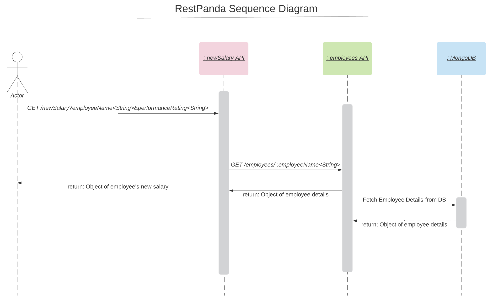

# RestPanda - Set of Restful APIs

Set of Restful CRUD APIs based on Node.js for rboilerplates, prototypes, demos & courses


# Quick Start

## Steps to Setup

Install mongodb by following the instructions given on this [link]

Install npm dependencies

```bash
npm install
```

Run Server

```bash
npm run start
```

You can browse the apis at <http://localhost:3000>


## APIs

The below sections outlines the Sequence Diagram & Details around the APIs

<!-- toc -->
* [SequenceDiagram](#sequenceDiagram)
* [Details](#details)

<!-- tocstop -->

### SequenceDiagram

<!-- sequenceDiagram -->




<!-- sequenceDiagramtop -->

### Details
<!-- details -->

This section outlines the details of the below 2 APIs:

* [employees](#employees)
* [newSalary](#newSalary)

#### employees

The employees API can be used to create/store employee information. It contains the following methods:

* [POST](#post)
* [GET](#get)

##### POST

<!-- post -->

> Endpoint: /employees - Use this endpoint to add a new employee to the DB


###### Body

| Field         | Data Type | Required | Example |
| ------------- |:---------:| --------:| -------:|
| employeeName  | String    | true     | user001 |
| emailId       | String    | true     | a@b.com |
| gender        | String    | false    | male    |
| title         | String    | true     | manager |
| currentSalary | Number    | true     | 100000  |
| experience    | Number    | true     | 8       |

<details>
<summary> Sample Curl Request...</summary>
<p>

```
curl --location --request POST 'http://localhost:3000/employees' \
--header 'Content-Type: application/json' \
--data-raw '{
    "employeeName": "user001",
    "emailId": "a@b.com",
    "gender": "male",
    "title": "manager",
    "currentSalary": 100000,
    "experience": 8
}'
```

</p>
</details>


<details>
<summary>Response Body...</summary>
<p>

```
{
    "_id": "5e7115d803b7cc50f8f93863",
    "employeeName": "user001",
    "emailId": "a@b.com",
    "gender": "male",
    "title": "manager",
    "currentSalary": 100000,
    "experience": 8,
    "createdAt": "2020-03-17T18:24:24.365Z",
    "updatedAt": "2020-03-17T18:24:24.365Z",
    "__v": 0
}
```

</p>
</details>

<!-- poststop -->


##### GET
<!-- get -->

> Endpoint /employees/:employeeName - Use this endpoint to Get information of one employee


###### Path Parameter

| Field         | Data Type | Required | Example |
| ------------- |:---------:| --------:| -------:|
| employeeName  | String    | false     | user001 |


<details>
<summary>Sample Curl Request...</summary>
<p>

```
curl --location --request GET 'http://localhost:3000/employees' \
--header 'Content-Type: application/json'
```

</p>
</details>


<details>
<summary>Response Body...</summary>
<p>

```
[
    {
        "_id": "5e7115d803b7cc50f8f93863",
        "employeeName": "user001",
        "emailId": "a@b.com",
        "gender": "male",
        "title": "manager",
        "currentSalary": 100000,
        "experience": 8,
        "createdAt": "2020-03-17T18:24:24.365Z",
        "updatedAt": "2020-03-17T18:24:24.365Z",
        "__v": 0
    }
]
```

</p>
</details>


> Endpoint /employees - Use this endpoint to Get information of all the employees available in the DB


<details>
<summary>Sample Curl Request...</summary>
<p>

```
curl --location --request GET 'http://localhost:3000/employees/user001' \
--header 'Content-Type: application/json'
```

</p>
</details>


<details>
<summary>Response Body...</summary>
<p>

```
{
    "_id": "5e7115d803b7cc50f8f93863",
    "employeeName": "user001",
    "emailId": "a@b.com",
    "gender": "male",
    "title": "manager",
    "currentSalary": 100000,
    "experience": 8,
    "createdAt": "2020-03-17T18:24:24.365Z",
    "updatedAt": "2020-03-17T18:24:24.365Z",
    "__v": 0
}
```

</p>
</details>

<!-- getstop -->


#### `newSalary`
This section provides details of all the methods that can give insights on two features (columns)


<!-- detailsstop -->