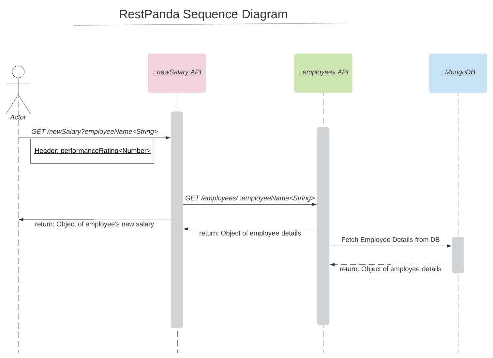

# Overview

Set of Restful CRUD APIs based on Node.js for boilerplates, prototypes, demos & courses

- 🚀 Simple & Intuitive set of APIs hosted locally to get you started instantly
- ⚡️️  Supports all CRUD operations
- 💎 Language Agnostic APIs that conform to REST principles
- 📼 Business logic that is helpful in explaing API mocking
- ⏱ Configurable delayed API Response
- 🔥 Path/Query Parameters, Headers & Optional fields for exhaustive coverage

# Steps to setup

Install mongodb by following the instructions given on this [link]

Install npm dependencies

```bash
npm install
```

Run Server

```bash
npm run start
```

You can browse the apis at <http://localhost:3000>


# APIs

The below sections outlines the Sequence Diagram & Details around the APIs

<!-- toc -->
* [SequenceDiagram](#sequenceDiagram)
* [Details](#details)

<!-- tocstop -->

## SequenceDiagram

<!-- sequenceDiagram -->




<!-- sequenceDiagramtop -->

## Details
<!-- details -->

This section outlines the details of the below 2 APIs:

* [employees](#employees)
* [newSalary](#newSalary)

### employees

The employees API can be used to create/store employee information. It contains the following Routes:

* /employees
* /employees/:employeeName

#### /employees

<!-- /employees -->

> **Methods Supported are POST and GET**


##### POST

> Use this method to add a new employee to the DB


###### Body

| Field         | Data Type | Required | Example |
| ------------- |:---------:| --------:| -------:|
| employeeName  | String    | true     | user001 |
| emailId       | String    | true     | a@b.com |
| gender        | String    | false    | male    |
| title         | String    | true     | manager |
| currentSalary | Number    | true     | 100000  |
| experience    | Number    | true     | 8       |

<details>
<summary> Sample Curl Request...</summary>
<p>

```
curl --location --request POST 'http://localhost:3000/employees' \
--header 'Content-Type: application/json' \
--data-raw '{
    "employeeName": "user001",
    "emailId": "a@b.com",
    "gender": "male",
    "title": "manager",
    "currentSalary": 100000,
    "experience": 8
}'
```

</p>
</details>


<details>
<summary>Response Body...</summary>
<p>

```
{
    "_id": "5e7115d803b7cc50f8f93863",
    "employeeName": "user001",
    "emailId": "a@b.com",
    "gender": "male",
    "title": "manager",
    "currentSalary": 100000,
    "experience": 8,
    "createdAt": "2020-03-17T18:24:24.365Z",
    "updatedAt": "2020-03-17T18:24:24.365Z",
    "__v": 0
}
```

</p>
</details>


##### GET

> Use this method to get information of all the employees available in the DB


<details>
<summary>Sample Curl Request...</summary>
<p>

```
curl --location --request GET 'http://localhost:3000/employees/user001' \
--header 'Content-Type: application/json'
```

</p>
</details>


<details>
<summary>Response Body...</summary>
<p>

```
{
    "_id": "5e7115d803b7cc50f8f93863",
    "employeeName": "user001",
    "emailId": "a@b.com",
    "gender": "male",
    "title": "manager",
    "currentSalary": 100000,
    "experience": 8,
    "createdAt": "2020-03-17T18:24:24.365Z",
    "updatedAt": "2020-03-17T18:24:24.365Z",
    "__v": 0
}
```

</p>
</details>

<!-- /employeesstop -->


#### /employees/:employeeName
<!-- /employees/:employeeName -->

> **Methods Supported are GET, PUT and GET**


##### GET

> Use this method to get the information of an employee


###### Path Parameter

| Field         | Data Type | Required | Example |
| ------------- |:---------:| --------:| -------:|
| employeeName  | String    | false     | user001 |


<details>
<summary>Sample Curl Request...</summary>
<p>

```
curl --location --request GET 'http://localhost:3000/employees' \
--header 'Content-Type: application/json'
```

</p>
</details>


<details>
<summary>Response Body...</summary>
<p>

```
[
    {
        "_id": "5e7115d803b7cc50f8f93863",
        "employeeName": "user001",
        "emailId": "a@b.com",
        "gender": "male",
        "title": "manager",
        "currentSalary": 100000,
        "experience": 8,
        "createdAt": "2020-03-17T18:24:24.365Z",
        "updatedAt": "2020-03-17T18:24:24.365Z",
        "__v": 0
    }
]
```

</p>
</details>


##### PUT

> Use this method to update the information of an employee

###### Path Parameter

| Field         | Data Type | Required | Example |
| ------------- |:---------:| --------:| -------:|
| employeeName  | String    | false     | user001 |


###### Body

| Field         | Data Type | Required | Example |
| ------------- |:---------:| --------:| -------:|
| employeeName  | String    | true     | user001 |
| emailId       | String    | true     | a@b.com |
| gender        | String    | false    | male    |
| title         | String    | true     | manager |
| currentSalary | Number    | true     | 100000  |
| experience    | Number    | true     | 8       |

<details>
<summary> Sample Curl Request...</summary>
<p>

```
curl --location --request PUT 'http://localhost:3000/employees/user001' \
--header 'Content-Type: application/json' \
--data-raw '{
    "employeeName": "user001",
    "emailId": "a@b.com",
    "gender": "male",
    "title": "director",
    "currentSalary": 120000,
    "experience": 10
}'
```

</p>
</details>


<details>
<summary>Response Body...</summary>
<p>

```
{
    "_id": "5e7115d803b7cc50f8f93863",
    "employeeName": "user001",
    "emailId": "a@b.com",
    "gender": "male",
    "title": "director",
    "currentSalary": 120000,
    "experience": 10,
    "createdAt": "2020-03-17T18:24:24.365Z",
    "updatedAt": "2020-03-20T20:50:03.590Z",
    "__v": 0
}
```

</p>
</details>


##### DELETE

> Use this method to delete the information of an employee

###### Path Parameter

| Field         | Data Type | Required | Example |
| ------------- |:---------:| --------:| -------:|
| employeeName  | String    | false     | user001 |


<details>
<summary> Sample Curl Request...</summary>
<p>

```
curl --location --request DELETE 'http://localhost:3000/employees/user001' \
--header 'Content-Type: application/json'
```

</p>
</details>


<details>
<summary>Response Body...</summary>
<p>

```
{
    "message": "Employee deleted successfully!"
}
```

</p>
</details>

<!-- /employees/:employeeNamestop -->


### `newSalary`
The newSalary API can be used to calculate the Salary . It contains the following Route:

* /newSalary

#### /newSalary

<!-- /newSalary -->

> **Method Supported is GET**

##### GET

> Use this method to calculate the salary of an Employee


###### Query Parameter

| Field         | Data Type | Required  | Example |
| ------------- |:---------:| ---------:| -------:|
| employeeName  | String    | false     | user001 |


###### Header

| Field              | Data Type | Required | Example |
| ------------------ |:---------:| --------:| -------:|
| performanceRating  | Number    | true     | 4.2     |


<details>
<summary>Sample Curl Request...</summary>
<p>

```
curl --location --request GET 'http://localhost:3000/newSalary?employeeName=user001' \
--header 'Content-Type: application/json' \
--header 'performanceRating: 4.2'
```

</p>
</details>


<details>
<summary>Response Body...</summary>
<p>

```
{
    "newSalary": 252000
}
```

</p>
</details>

<!-- /newSalarystop -->

<!-- detailsstop -->