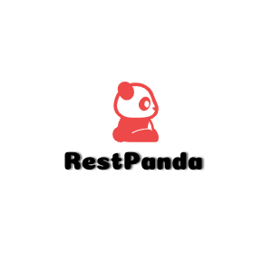

  

<!--  -->

> Set of Restful APIs for quick prototyping, demos & tutorials

- 🚀 Simple & Intuitive set of APIs hosted locally to get you started instantly
- ⚡️️  Supports all CRUD operations
- 💎 Language Agnostic APIs that conform to REST principles
- 📼 Business logic that is helpful in explaing API mocking
- ⏱ Configurable delayed API Response
- 🔥 Path/Query Parameters, Headers & Optional fields for exhaustive coverage

  <a href="https://github.com/SimitTomar/RestPanda" target="_blank">GitHub</a>
  <a href="#/README">Get Started</a>

